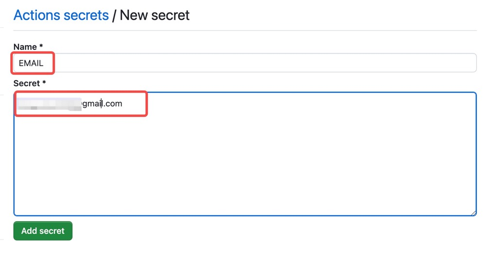

# dukou-checkin
这是一个 Dukou 网站的自动签到脚本，每天自动执行，用于领取流量。 
**注意**：本脚本以学习为目的，使用后果自己承担！
# 功能
✅ 每日 20:30 定时运行  
❎ 通过secrets自定义时间
# 使用
1. fork 该仓库到自己的 GitHub；
2. 添加两个 secrets：`EMAIL` 和 `PASSWD`:
   
   
   
3. 然后每天的 20:30(北京时间) 会自动进行签到，在 Actions 中查看运行结果；
4. 目前不支持通过secrets自定义时间，如果想修改时间，更改 .github/workflows/python.yml 文件中的 `cron` 字段。注意是世界标准时间；corn格式可以参考网站：https://crontab.guru/
